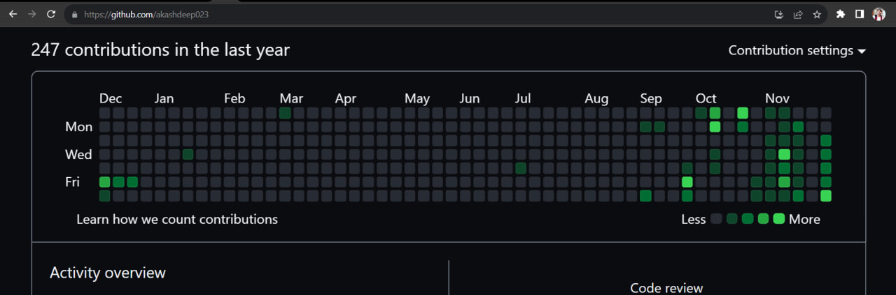

# Hack Github Graph
---
## Technologies used:
- Javascript
- node.js

## Package use
- [jsonfile](https://www.npmjs.com/package/jsonfile)
- [simple-git](https://www.npmjs.com/package/simple-git)
- [moment](https://www.npmjs.com/package/moment)

## How to Use
- 1st : Copy repo link... || Github
- 2nd : Create a folder.. || VS Code
- 3rd : git clone https://github.com/akashdeep023/Hack_Github_Graph.git || Type command in VS Code terminal
- 4th : npm install || Type command in VS Code terminal
- 5th : rm -rf .git || Type command in VS Code terminal
- 6th : git init    || Type command in VS Code terminal
- 7th : git add .   || Type command in VS Code terminal
- 8th : git commit -m "add file"  || Type command in VS Code terminal
- 9th : Create a new repo and copy repo link (Without readme.md) || Github
- 10th : git remote add origin repo_link || Type command in VS Code terminal
- 11th : git push -u origin main  || Github
- 12th : node index.js  || Type command in VS Code terminal
<b>Done Check Github Graph</b>

### Follow My Github Account [Link](https://github.com/akashdeep023)
## Example Image..

